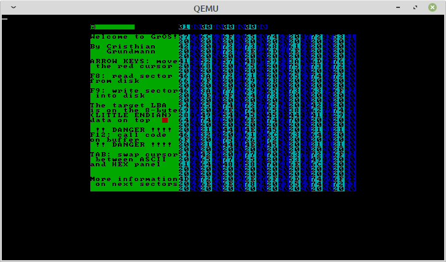

# GrOS
Maybe the world's smallest hex editor

## Welcome to GrOS
This is a "single sector" bootable hexadecimal editor.
To run it, you must boot it.
Just write the image file "disk.bin" into the some disk and you're ready to go.

Please, use GrOS with **caution** and use it on a **toy disk** (A disk only for it).
I recommend testing it first in an emulator.

You can assemble the source code yourself with NASM:

`nasm disk.asm -f bin -o disk.bin`

## Getting started
When booted, GrOS should display a `16 color 80x50 text mode screen, with an 8x8 font`.
Like this: 

Like on most hex editors, GrOS has an ASCII and a hexadecimal panel available for editing.

The ASCII panel is on the left with `16x32` characters.
On the right is the hexadecimal panel, with `32x32` characters (since a byte is represented here with 2 hexadecimal digits).
This panel has vertical bars of alternating colors to assist you in distinguishing the bytes.

The data you edit is a raw disk sector, and on top of both panels is the `8 byte` *LBA* address of that sector (in Little Endian).
If the data is also code, you can call it.

Everything else is void and you can't write on it, even though you can hover the cursor on it.

There is a red cursor that indicates where you are typing. It only appears when GrOS is waiting for a keystroke.
When the cursor is on the ASCII panel, you can type any letter. On the hex board, you can only type the ten digits and the upper case letters from `A` to `F`.

When you type on any panel, the bytes changed are displayed in a different color until you save your progress on disk or discard it by reading a fresh sector.

You can only use the keyboard, with a fixed layout.

## Key controls

  - **Arrow keys**:
  Move the cursor around.
  
  - **Any ASCII char**: Attempts to type on the buffer. Always fail on void and may fail on hex panel, if you type a non hex digit.
  
  - **F8**: Reads the sector from disk, discarding any changes. This restores all colors.
  
  - **F9**: Writes the buffer into disk saving any changes. This also restore all colors.
  
  - **F12**:  Calls the code on buffer.
    **Use with CAUTION, as it may crash GrOS or corrupt ANY disk connected.**
  
  - **TAB**: Swap the cursor position between the ASCII and the hex panels.

## Notes
  - When you type data in either panel, only the video memory is changed. 
  When you `save` the sector, the video data is dumped into a memory buffer which in turn is stored in the actual disk.
  When you `read` the sector, the disk sector is read into the memory buffer and the video memory updates automatically.
  It's only the memory buffer that can run custom code, of course, so you need to `save` the data into the disk to actually update it.
  - The read and write functions use the `DL` register to indicate which disk to operate.
When the BIOS jumps execution into GrOS, this same register determines which disk GrOS is editing.
The GrOS code never changes the value of this register. The only way to change it is by running the code in buffer.
  - In order to the **F12** command to be executed, the code must start with `0x9090` as a protection layer. This actually performs two `NOP` instructions.
  - The text displayed in the preview image is only for demonstration purposes.
  - In an emulator like `qemu`, you can to add some extra sectors since editing the first is risky.
